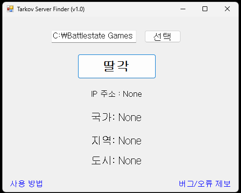
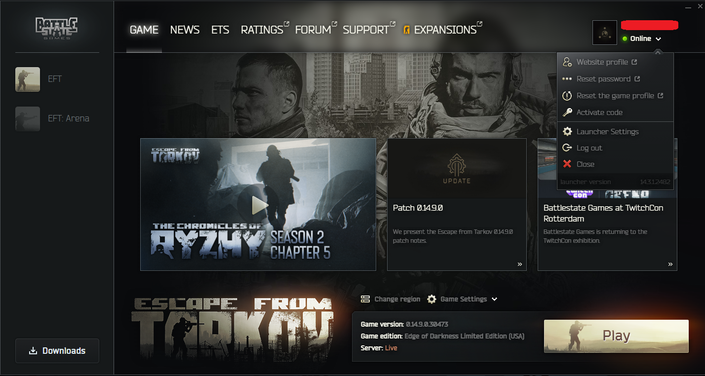
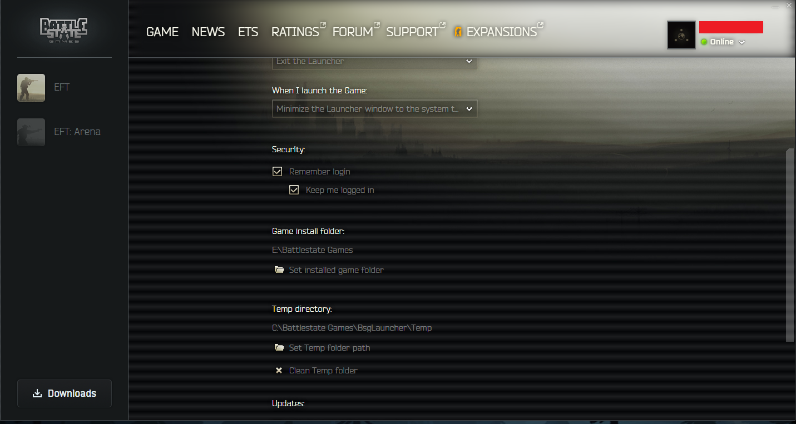

# Tarkov Server Finder
 
## 사용 방법

**1. 프로그램 실행**

  

**2. 런쳐를 통해 어느 드라이브에 탈콥을 설치했는지 확인**

런쳐에서 프로필 클릭 > `Launcher Settings` > Game install folder 확인

  

**3. 프로그램 상단의 파일 경로를 바꾸기**
대부분이 C 드라이브라 기본 설정은 C드라이브이므로 다른 곳에 설치했다면 바꿔주기

  

**4. 매칭 잡고 `딸각` 버튼 누르기**